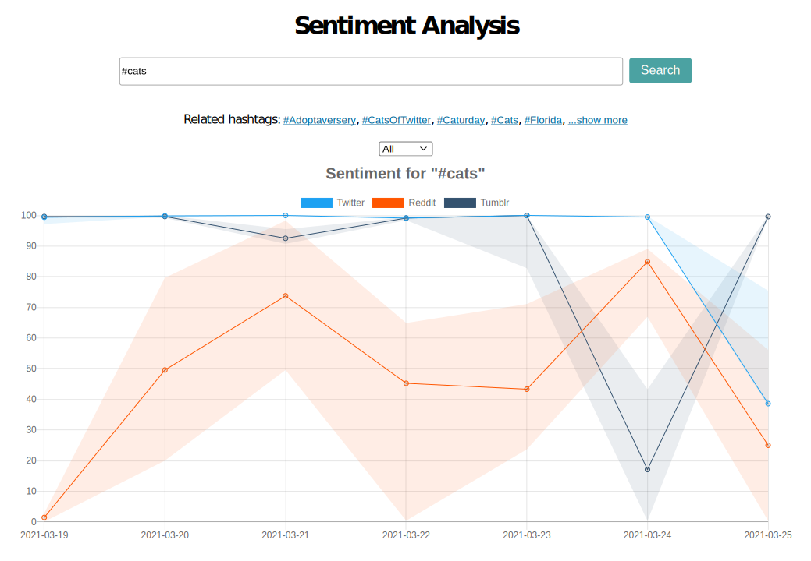
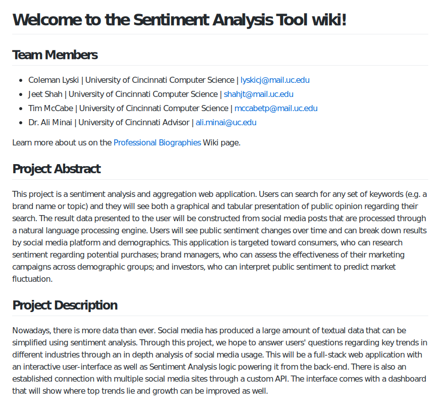
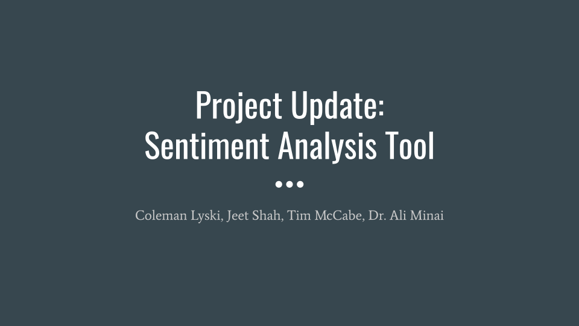
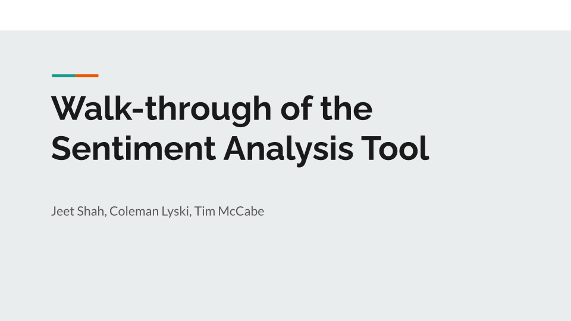

# Sentiment Analysis Tool Final Report

Table of contents:

<!-- no toc -->
1. [Project Description](#project-description)
2. [User Interface Specification](#user-interface-specification)
3. [Test Plan and Results](#test-plan-and-results)
4. [User Manual](#user-manual)
5. [Spring Final PPT Presentation](#spring-final-ppt-presentation)
6. [Final Expo Poster](#final-expo-poster)
7. [Assessments](#assessments)
   1. [Tim Initial Assessment](#tim-initial-assessment)
   2. [Jeet Initial Assessment](#jeet-initial-assessment)
   3. [Coleman Initial Assessment](#coleman-initial-assessment)
   4. [Tim Final Assessment](#tim-final-assessment)
   5. [Jeet Final Assessment](#jeet-final-assessment)
   6. [Coleman Final  Assessment](#coleman-final--assessment)
8. [Summary of Hours and Justification](#summary-of-hours-and-justification)
   1. [Tim](#tim)
   2. [Jeet](#jeet)
   3. [Coleman](#coleman)

## Project Description

This project analyzes the sentiment of social media data to display trends in public opinion. Users search for a set of keywords, then data from the past week is analyzed from Twitter, Reddit, and Tumblr and displayed on a graph.

## User Interface Specification

There is a search bar at the top, and users can search for a topic or a hashtag. Below that, they can see related hashtags, and then they can select which social media platforms to view sentiment data for. At the bottom there is a graph, showing public sentiment regarding their search over time.

## Test Plan and Results

## User Manual

[Check out our Wiki](https://github.com/iamcoleman/senior-design/wiki)

## Spring Final PPT Presentation

Click to view the slideshow:

Click to view the video presentation:

## Final Expo Poster

## Assessments

### Tim Initial Assessment

My group's senior design project is a sentiment analysis platform. It will use social media data to assess public opinion of a topic or brand. It will allow users to view sentiment over time and assess how public perception has changed. This project combines natural language processing and artificial intelligence with API design and web development. It will require well-designed algorithms, smart caching, and scalable design to work efficiently. The result will be accessible as a website and potentially as a public API.

This project will use Python, which we learned in CS 2021 - Python Programming. It will also require concepts from CS 4071 - Design and Analysis of Algorithms, as we will need to efficiently sort and manipulate data. CS 5168, which I am currently taking, will likely be useful. Neural networks are highly parallel, and natural language processing often uses neural networks. I am also taking CS 5154 - Information Retrieval, which will provide insight on how to search social media and parse basic information from the text. This course will also help me to mathematically assess how accurate our results are.

While working at Siemens PLM Software I learned about the basics of back-end development and about frameworks for front-end development. This will be useful for developing the web interface for the application. I also worked with Jeet at this job, so we have already established rapport. At Worldpay/FIS, I have learned much more about API design and building maintainable code. This will keep the project manageable and prevent us from creating unworkable code. I have also learned how to review code well and how to manage collaboration, especially between front-end and back-end developers.

I am excited to work on this project because it broadens my horizons while capitalizing on my skills. I am not very familiar with natural language processing or with Python. That said, I have a lot of experience with web development and API design. I am also excited to collaborate with Jeet and Coleman. They have different backgrounds than I do - both focusing more on data science than web development. I think this difference will help us be more productive and learn from each other, as well as establish roles for each of us in the project so we're not all working on the same parts of the code at the same time.

We will likely start by building engines to read text and determine whether it matches keywords and what sentiment is behind it. We will then scale this out by integrating social media APIs to gather data and building an API to share the data. Then we will build a site that uses the API and aggregates the data. We are planning to use Python for the back end and React for the front end. The MVP will be a site where you can enter keywords and get a graph of public perception over time. Once this is done, we will continue to add features while time allows. I will self-evaluate based on how well the web interface is done, as this is the part of the project that I will likely be the most involved in. I will also evaluate how well I was able to adapt and learn the data science aspects of the project.

### Jeet Initial Assessment
Hi my name is Jeet Shah, and in my senior year I will be working on a project regarding
Natural Language Processing and social media alongside Coleman Lyski and Tim McCabe. We
are focused on creating a website that will allow users to get a complete understanding of a
keyword based on sentiment analysis done across social media and other sites. For example,
we hope that someone can search for a sports team and see how people across the country
feel about that given word. The key components of this project are Web Development and Data
Science. For the site we will be using React/Javascript and for the backend it will be
Flask/Python. I feel very prepared for a project like this through classes such as Info Retrieval
and Intelligent Data Analysis. Natural Language Processing is a very important part of the
innovation happening in today’s age and I am very much looking forward to working on this
project.

My college experience at the University of Cincinnati has gone a long way in helping me
become the professional I am today. The classes that really helped me on the path to becoming
a Data Scientist are Python Programming, Database Theory, and Intelligent Data Analysis.
These classes gave me a lot of high level knowledge for when I interviewed for positions and
when on the job as well. Python Programming was the first class where I felt really confident
that I could program at a high level. Following that, Database Theory gave me a very strong
level of exposure to SQL and databases in general. Ultimately, IDA was the class that gave me
the knowledge of key algorithms and most importantly, when to use each algorithm. This was
really important in my last two co-ops.

I have had the chance to do five co-ops in my time at UC along with two part-time
internships. From a cumulative perspective, this has given me over 90 weeks of work
experience while I was in college. My first co-op was at GE Digital where I was a Digital Technology Intern and worked on Web Development using the Angular Framework. After this, I started working at Siemens PLM where my first rotation involved doing Back-End Development
with Java, MongoDB, and NodeJS. In my third co-op, I returned to Siemens and had a more
data engineering based role where I did natural language processing, machine learning, and
some more web development projects. My fourth rotation was as a Data Science Intern at
84.51, an analytics firm owned by Kroger where I worked on creating a visualization tool for food
insecurity across the United States. I loved my time at 8451 and returned for another rotation
where I worked as a Data Science Intern on the Fuel Analytics team. I became very skilled in
Python and SQL in my last two rotations and I’ve ultimately accepted a full time role as a Data
Scientist at 84.51.

I am really excited to get started on this project because I feel like Natural Language
Processing will be a really important skill to have in the future. Being able to comprehend text
using algorithms can be utilized for many potential business ideas or even to help a company
I’m working at. I hope to one day specialize in this area, especially if this project ends up being
as enjoyable as I think it will be. I also feel very motivated to do well in this area because I think
this will provide me with a lot more credibility in the analytics space. With people transitioning
from phone calls to text, having a strong understanding of text communication will be critical.
I have high expectations for myself and my group in this project. By the end of the year, I
hope that we are able to have a highly functional website that can quickly provide sentiment
based feedback on different terms a user may provide. As we move into the design phase, at a
high level I see this being divided into a Web Dev and NLP project where React and Python can
be used. By the end of this I will know if we did a good job based on overall team sentiment
along with having a functional product. If we have time I hope to dive deeper into terms based
on individual sports teams and maybe even country names.

### Coleman Initial Assessment

Sentiment analysis is used to interpret and classify emotions within textual data using text analysis techniques. My senior design project is a web application that will allow users to search for any set of keywords. The application will then look for the use of these keywords in various online sources, such as social media (Twitter, Facebook, etc.), news outlets (New York Times, LA Times, etc.), and forums (Reddit, Quora, etc.). Finally, the application will perform sentiment analysis across all of the gathered text in order to generate a final report. The goal is to create a report that accurately represents what is currently being said about the searched for keywords across the internet at that given moment. 
   
While my entire college curriculum will guide the development of this project, there are a few courses that stand out from the rest. In order to perform accurate sentiment analysis, tons of textual data is required. Anytime an application is dealing with large amounts of data, it is critically important to make this data as small, quick, and easily accessible as possible. My Data Structures (CS 2028) and Algorithms (CS 4071) courses gave me the knowledge I need to create useful structures for storing and manipulating the textual data. Another helpful course is the Cloud Computing (CS 5165) course I am taking this semester. Powerful computers are going to be needed to perform the analysis quickly on large amounts of data. Our team will be able to leverage machines on the cloud to do the analysis in a fast and efficient manner. 

I have received plenty of experience with building applications from the ground up and deploying them through all my co-ops. On my third co-op with Teradata as a Software Engineer Intern, I was responsible for creating new Angular web applications and getting them deployed to our internal environment. This gave me experience in creating a CI/CD pipeline for a brand-new application, which pretty much mirrors what we will have to do with this senior design project. On my fourth co-op with Siemens as a DevOps Intern, I had to create another web-based application that performed text analysis on large amounts of JavaScript project files. Although the analysis I was doing was not quite sentiment analysis, many of the same techniques I used can be carried over to this senior design project – things like parsing the text, cleaning the text, and storing the text in an efficient manner. 

One of the aspects of this project that is the most attractive to me is how many different use cases it can be applied to. Although our team has a solid idea of what we want to create, I believe this project can grow and transform as we work on it. What we are really creating with this project is an extremely solid platform that can then be added to and modified to fit all sorts of different needs or goals. At the core, all this tool will do is grab the real-time sentiment of any keywords across the internet, but what can be done next with the data is the promising part. For example, if one were to start gathering the sentiment of stock tickers and comparing it to the prices of stocks, then this application could be utilized to create an advanced financial tool.

Because this project is so fluid, I think the best approach is to start small and figure out what works and what needs to be rethought. We may want to start with gathering the textual data from a small group of sources – possibly just Twitter and Reddit in the beginning. Then with this text data, we can perform the sentiment analysis to generate a simple report, one that might only give a “positive”, “neutral”, and “negative” output. Finally, we can implement a barebones web application that allows a user to search for what they want and receive the analysis real-time in their browser. Once we have this initial application up and running, we will be able to add in more depth and complexity one piece at a time, such as more detailed reports, drawing from a wider group of sources, and more complex analysis tools. 

We will know this project is done when a user is able to access our website, search for whatever keywords they would like, and received real-time sentiment analysis of those keywords from across the internet. We will know the project does a good job when after receiving the sentiment report, the user can perform a Google search with the same keywords and receive articles/blog posts/social media feeds/etc. that share the same sort of general sentiment as the one we were able to infer from our application.

---

### Tim Final Assessment

Most of my work was related to the Node server and React front end. I created the Node server and integrated it with all of the APIs. This includes the search endpoints for Twitter and Reddit, as well as the hashtag search endpoint for Tumblr. I had the server extract the hashtags and parse the text data from the results to send to the Python API. All of these requests were asynchronous, and I took care to ensure that nothing that didn’t need to block other processes was blocking. I then added an endpoint to the server to retrieve the results from the Python API, if available, and transform them for usage by the front end. I also set up the React site, which included a graphical display of the data from the Node server. On the site, you can view related hashtags and see the weekly trends for sentiment, along with the range of the 60th and 40th percentiles.
I did not get as much of an opportunity as I had hoped to work on the sentiment analysis portion of the project. However, I worked on my web development experience, and this will help me in the future as a full-stack developer. By challenging myself to ensure that all of the requests and processing were asynchronous, I developed my ability to think in terms of concurrency and avoid race conditions.

### Jeet Final Assessment
During the school year of 2020 - 2021, my group of Coleman Lyski, Tim McCabe, and I
(Jeet Shah) worked on the Sentiment Analysis Tool for Senior Design. From a high level
view, my contributions were focused on building the classifiers for sentiment analysis by
using Natural Language Processing libraries and machine learning algorithms.
Additionally, I tested multiple solutions for many variations of social media platforms to
see where our Sentiment Analysis would fit in best. Outside of the technical
contributions, I also played a large role in the building of our final powerpoint and video
presentation, where I focused on the sentiment analysis portion of the project.

From a learning standpoint, I would consider the past semester to be very successful
when it comes to my knowledge of Natural Language Processing and sentiment
analysis as a whole. I was able to dive deeper into Python and its respective libraries
while also incorporating outside packages such as Google’s Universal Sentence
Encoder. I had never worked with machine learning outside of class, so this was an
amazing opportunity to apply that knowledge to the real world. This was my first time
working with neural networks and I learned about recurrent neural networks and was
able to learn more about LSTM and BiLSTM neural networks as well. In terms of
obstacles, one of the main ones was the inability to work together in person. Even
though Computer Science works well remote, the brainstorming and research phases
would have been much smoother if we had been in-person. Additionally, another
obstacle was my computer’s inability to process large amounts of data in a short period
of time, so I had to write scripts to send to Coleman to train the classifiers. Overall, I am
very happy with how the semester went and had a great experience with my group.

### Coleman Final  Assessment

From our initial planning, the project was split up into three main sections: the frontend and Node.js server, the backend and Python Flask server, and the sentiment analysis scripts. Because I had previous experience with building out Flask APIs, I was assigned the backend and Flask server portion of the project. I was able to build out the Flask API and the Postgres database with relative ease because it was very similar to work I have done in previous co-ops and personal projects. Being able to grab bits and pieces of code from previous work really allowed me to speed up my development while maintaining a high level of code quality.

However, towards the end of my work, we realized that there was a major bottleneck in the Flask API when it had to run multiple sentiment analysis requests at the same time – the requests were all running sequentially, which caused the entire API to slow to a crawl. I went on to do some additional research into projects similar to ours. I eventually found a Python library called Celery that could remove the bottleneck. Celery is a task scheduler, which means that it is able to create tasks (the sentiment analysis requests) that could be queued and ran in parallel with the Flask API when resources were available. Celery also allowed the application to become quite scalable. Whenever the Celery task queue begins to fill up with many tasks, it is as simple as spinning up a second Celery worker so the tasks can be split between them, thus cutting the time in half. I believe finding a solution to the bottleneck was my biggest obstacle, but finding the solution was also my greatest accomplishment and learning experience. This was the first time I had to add parallelization to a Python project. I was also very proud of the fact that I made an API that was highly scalable, thus making a product that is ready to be deployed in the real world. 

## Summary of Hours and Justification

### Tim

| Task | Hours |
| - | - |
| Setting up Node server | 5 |
| Integrating with Twitter API | 7 |
| Integrating with Reddit API | 7 |
| Integrating with Tumblr API | 7 |
| Integrating with Python engine API | 12 |
| Extracting hashtags | 3 |
| Setting up front end | 4 |
| Styling front end | 4 |
| Integrating with Node server | 7 |
| Creating graph | 9 |
| Adding percentile display | 8 |
| Adding platform selection dropdown | 5 |
| Adding related hashtags | 3 |

### Jeet

### Coleman
